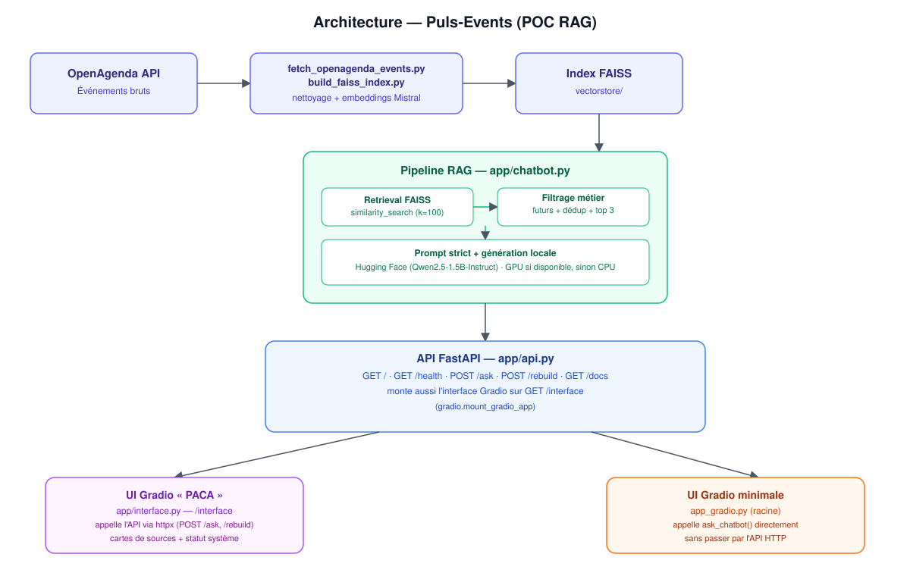

# POC Chatbot RAG — Puls-Events

**Projet réalisé dans le cadre d'une formation OpenClassrooms.**

Puls-Events est un **POC de chatbot RAG (Retrieval-Augmented Generation)** conçu pour répondre en langage naturel à des questions sur des événements culturels, patrimoniaux et associatifs en région **Provence-Alpes-Côte d'Azur**. Le système s'appuie sur des données réelles récupérées via l'API **OpenAgenda**, indexées sémantiquement dans une base **FAISS**, puis interrogées par un pipeline RAG complet exposé à la fois via une **API REST FastAPI** et une **interface web Gradio** sur mesure.

Au-delà du pipeline RAG "classique", le projet met l'accent sur des points souvent négligés dans un POC :
- un **prompt engineering strict** pour limiter les hallucinations et empêcher le modèle de proposer des événements passés ou inventés ;
- un **filtrage métier** des résultats (événements futurs uniquement, dédoublonnage) appliqué en amont de la génération ;
- une **API de reconstruction à la demande** de l'index (`POST /rebuild`) plutôt qu'un pipeline figé ;
- une **démarche d'évaluation itérative** avec Ragas, avec un vrai retour d'expérience sur les limites rencontrées (voir [Évaluation](#évaluation-ragas)).

## Sommaire

- [Fonctionnalités clés](#fonctionnalités-clés)
- [Architecture](#architecture)
- [Stack technique](#stack-technique)
- [Structure du projet](#structure-du-projet)
- [Prérequis](#prérequis)
- [Installation](#installation)
- [Configuration](#configuration)
- [Utilisation](#utilisation)
  - [Lancement en local](#lancement-en-local)
  - [Lancement avec Docker](#lancement-avec-docker)
- [Routes de l'API](#routes-de-lapi)
- [Interfaces utilisateur](#interfaces-utilisateur)
- [Tests](#tests)
- [Évaluation (Ragas)](#évaluation-ragas)
- [Intégration continue](#intégration-continue)
- [Roadmap](#roadmap)
- [Contribuer](#contribuer)
- [Licence](#licence)

## Fonctionnalités clés

- **Ingestion automatisée** des événements OpenAgenda (`scripts/fetch_openagenda_events.py`), paramétrable par ville, mot-clé et volume maximal.
- **Indexation vectorielle FAISS** des événements (`scripts/build_faiss_index.py`), reconstructible à tout moment sans redéploiement grâce à l'endpoint `POST /rebuild`.
- **Pipeline RAG "métier"** (`app/chatbot.py`) qui ne se contente pas d'un `similarity_search` brut :
  - récupération large (100 chunks candidats) puis **filtrage des seuls événements futurs** et **dédoublonnage** ;
  - conservation des **3 événements les plus pertinents**, dans l'ordre du score FAISS ;
  - **prompt système strict** (pas d'invention de date/lieu/tarif, pas d'événement passé, pas de Markdown, réponse en français rédigée en paragraphes) ;
  - **post-traitement de la réponse** pour signaler explicitement quand moins de 3 événements sont disponibles.
- **Séparation embeddings / génération** : les embeddings sont calculés via l'API **Mistral** (`mistral-embed`), tandis que la génération de texte tourne en local avec un modèle **Hugging Face** (`Qwen/Qwen2.5-1.5B-Instruct` par défaut), avec **détection automatique GPU/CPU** (`torch.cuda.is_available()`).
- **API REST FastAPI** documentée automatiquement (Swagger), avec gestion d'erreurs explicite (400 si question vide, 500 en cas d'erreur pipeline, 504 en cas de timeout de reconstruction).
- **Interface Gradio sur mesure** (thème "PACA", CSS personnalisé) montée directement sur l'application FastAPI via `gradio.mount_gradio_app`, affichant la réponse générée **et** les événements sources sous forme de cartes, avec vérification live de l'état de l'API.
- **Conteneurisation Docker** avec healthcheck, et pipeline d'entrypoint qui réalise à chaud la collecte + l'indexation avant de démarrer l'API.

## Architecture



- `scripts/fetch_openagenda_events.py` récupère les événements depuis OpenAgenda.
- `scripts/build_faiss_index.py` construit l'index vectoriel FAISS à partir de ces données, avec les embeddings Mistral.
- `app/chatbot.py` expose la fonction `ask_chatbot(question)`, cœur du pipeline RAG (retrieval FAISS, filtrage métier, prompt engineering, génération locale via Hugging Face).
- `app/api.py` expose cette logique via une API **FastAPI**, et **monte également l'interface Gradio** (`app/interface.py`) directement dans l'application via `gradio.mount_gradio_app`, accessible sur `/interface`.
- `app/interface.py` construit l'interface Gradio thématisée "PACA" : elle **n'appelle pas `ask_chatbot` directement**, mais consomme l'API FastAPI (`POST /ask`, `GET /health`, `POST /rebuild`) via `httpx`, ce qui découple totalement l'UI du backend.
- `app_gradio.py`, à la racine, est une **interface Gradio minimale** alternative qui, elle, appelle `ask_chatbot()` directement (sans passer par l'API HTTP) — pratique pour tester le pipeline RAG en isolation.

## Stack technique

| Composant                    | Technologie                                                        |
| ------------------------------ | --------------------------------------------------------------------- |
| Langage                       | Python 3.11                                                          |
| Orchestration / retrieval     | LangChain, `langchain-community` (vector store FAISS)               |
| Base vectorielle              | FAISS (`faiss-cpu`)                                                 |
| Embeddings                    | Mistral AI (`langchain-mistralai`, modèle `mistral-embed`)          |
| Génération de texte           | Modèle Hugging Face local (`transformers`, `Qwen/Qwen2.5-1.5B-Instruct` par défaut), exécution GPU (CUDA) si disponible, sinon CPU |
| Source de données             | API OpenAgenda                                                      |
| API backend                   | FastAPI + Uvicorn + Pydantic                                         |
| Interface utilisateur         | Gradio (thème et CSS personnalisés, montée dans FastAPI)             |
| Client HTTP interne (UI → API)| `httpx`                                                              |
| Évaluation RAG                | Ragas                                                                |
| Tests                          | Pytest                                                              |
| Conteneurisation               | Docker                                                              |

> Le `requirements.txt` inclut également des dépendances Google Cloud (Vertex AI, GenAI, BigQuery, Storage...), explorées pendant le projet comme alternative possible aux composants Mistral / Hugging Face.

## Structure du projet

```
dev_systeme_rag/
├── app/
│   ├── api.py               # Application FastAPI : routes + montage de l'UI Gradio
│   ├── chatbot.py            # Pipeline RAG : retrieval FAISS, filtrage, prompt, génération
│   ├── interface.py          # Interface Gradio "PACA" (consomme l'API via httpx)
│   └── interface_style.py    # Thème et CSS personnalisés de l'interface Gradio
├── scripts/                  # Récupération OpenAgenda + construction de l'index FAISS
├── tests/                    # Tests unitaires (Pytest)
├── data/                     # Données locales non versionnées
├── vectorstore/              # Index vectoriel FAISS non versionné
├── docs/                     # Documentation technique
├── .github/workflows/        # Workflows d'intégration continue (GitHub Actions)
├── app_gradio.py             # Interface Gradio minimale, en appel direct à ask_chatbot()
├── docker-entrypoint.sh      # Point d'entrée Docker (fetch + index + API)
├── Dockerfile                # Image Docker de l'application
├── .env.example              # Exemple de variables d'environnement
├── .gitignore                 # Fichiers exclus du dépôt Git
├── requirements.txt          # Dépendances Python
└── README.md                  # Documentation du projet
```

## Prérequis

- Python **3.11**
- Une clé API **Mistral** (https://console.mistral.ai/)
- Une clé API **OpenAgenda** (https://developers.openagenda.com/)
- Docker (optionnel, pour un déploiement conteneurisé)

## Installation

1. Cloner le dépôt :

   ```bash
   git clone https://github.com/EthanChmt/dev_systeme_rag.git
   cd dev_systeme_rag
   ```

2. Créer et activer un environnement virtuel :

   ```bash
   python -m venv venv
   source venv/bin/activate      # Linux / macOS
   venv\Scripts\activate         # Windows
   ```

3. Installer les dépendances (les versions CPU de PyTorch sont utilisées par défaut) :

   ```bash
   pip install --upgrade pip
   pip install -r requirements.txt --extra-index-url https://download.pytorch.org/whl/cpu
   ```

## Configuration

Copier le fichier d'exemple et compléter les variables d'environnement :

```bash
cp .env.example .env
```

| Variable                      | Description                                                                                   |
| ------------------------------ | ----------------------------------------------------------------------------------------------- |
| `MISTRAL_API_KEY`              | Clé API Mistral, utilisée pour générer les **embeddings** (construction et interrogation de l'index FAISS) |
| `MISTRAL_EMBEDDING_MODEL`      | Modèle d'embedding Mistral à utiliser (`mistral-embed` par défaut)                              |
| `HUGGINGFACE_GENERATION_MODEL` | Modèle Hugging Face utilisé pour la **génération** de la réponse (`Qwen/Qwen2.5-1.5B-Instruct` par défaut) |
| `OPENAGENDA_API_KEY`           | Clé API OpenAgenda                                                                              |
| `OPENAGENDA_AGENDA_UID`        | Identifiant de l'agenda OpenAgenda à interroger                                                 |
| `OPENAGENDA_SEARCH`            | Filtre de recherche optionnel sur les événements                                                |
| `OPENAGENDA_CITY`              | Filtre optionnel par ville                                                                      |
| `OPENAGENDA_MAX_EVENTS`        | Nombre maximum d'événements à récupérer (300 par défaut)                                        |
| `API_BASE_URL`                 | URL de base de l'API FastAPI utilisée par l'interface Gradio (`app/interface.py`) pour ses appels HTTP (`http://127.0.0.1:8000` par défaut) |

> Le fichier `.env.example` versionné dans le dépôt liste une version simplifiée de ces variables (`MISTRAL_MODEL` au lieu de `MISTRAL_EMBEDDING_MODEL` / `HUGGINGFACE_GENERATION_MODEL`) : pense à l'aligner avec les noms réellement lus dans `app/chatbot.py` si tu modifies le modèle de génération.

## Utilisation

### Lancement en local

1. Récupérer les événements OpenAgenda :

   ```bash
   python scripts/fetch_openagenda_events.py
   ```

2. Construire l'index FAISS :

   ```bash
   python scripts/build_faiss_index.py
   ```

3. Lancer l'API FastAPI :

   ```bash
   uvicorn app.api:app --host 0.0.0.0 --port 8000
   ```

### Lancement avec Docker

L'image Docker automatise les trois étapes ci-dessus au démarrage du conteneur (`docker-entrypoint.sh`) puis expose l'API sur le port `8000`.

```bash
docker build -t puls-events-rag .
docker run --env-file .env -p 8000:8000 puls-events-rag
```

Un healthcheck interroge `http://127.0.0.1:8000/health` toutes les 30 secondes.

## Routes de l'API

Toutes les routes sont exposées par `app/api.py` (`http://localhost:8000` en local).

| Méthode | Route         | Description                                                                                     |
| -------- | ------------- | ------------------------------------------------------------------------------------------------- |
| `GET`    | `/`           | Message de bienvenue et lien vers la documentation                                                |
| `GET`    | `/health`     | Healthcheck simple (`{"status": "ok"}`), utilisé par Docker et par l'UI Gradio                    |
| `POST`   | `/ask`        | Question envoyée au pipeline RAG. Corps : `{"question": "..."}`. Réponse : `question`, `answer`, `sources[]` (uid, titre, dates, lieu, ville, adresse) |
| `POST`   | `/rebuild`    | Relance à chaud `fetch_openagenda_events.py` puis `build_faiss_index.py`, et renvoie les logs des deux scripts. Timeout : 300 s (erreur `504` en cas de dépassement) |
| `GET`    | `/docs`       | Documentation interactive Swagger générée automatiquement par FastAPI                              |
| `GET`    | `/interface`  | Interface Gradio "PACA" montée sur l'application FastAPI (`gradio.mount_gradio_app`)               |

## Interfaces utilisateur

Le projet propose **deux interfaces Gradio distinctes**, à des fins différentes :

- **`app/interface.py`** — l'interface principale, thématisée "PACA" (bandeau d'accueil, cartes d'événements sources, statut système, bouton de reconstruction de l'index). Elle est montée directement dans l'application FastAPI et accessible sur `/interface`. Elle **ne touche jamais au pipeline RAG directement** : elle consomme l'API HTTP (`POST /ask`, `GET /health`, `POST /rebuild`) via `httpx`, ce qui permet de la déployer indépendamment du backend si besoin.
- **`app_gradio.py`** — une interface minimaliste à la racine du projet, pensée pour tester rapidement le pipeline RAG **en local et sans passer par l'API** (elle appelle `ask_chatbot()` directement) :

  ```bash
  python app_gradio.py
  ```

  Exemples de questions proposées :
  - « Quels sont les prochains événements musicaux dans la région ? »
  - « Quelles visites sont prévues prochainement ? »
  - « Quels événements ont lieu à Marseille ? »

Une fois l'API lancée, la documentation interactive est disponible sur `http://localhost:8000/docs`, et l'interface "PACA" complète sur `http://localhost:8000/interface`.

## Tests

Les tests unitaires (Pytest) se trouvent dans `tests/` :

```bash
pytest
```

## Évaluation (Ragas)

La qualité des réponses générées par le pipeline RAG a été évaluée avec **Ragas**, sur une échelle de notation de **1 à 5**.

Cette évaluation a fait l'objet d'une véritable itération de mise au point : les premières séries de tests renvoyaient quasi systématiquement des scores de **1/5**. L'analyse a permis d'identifier que la limite de tokens allouée à la génération (`max_new_tokens`) était trop basse, ce qui tronquait les réponses du modèle avant qu'elles ne soient complètes — et donc faussait mécaniquement l'évaluation Ragas (réponses jugées incomplètes ou hors-sujet alors que le pipeline de retrieval fonctionnait correctement). Après augmentation de cette limite, les scores moyens obtenus sur les runs suivants ont nettement progressé.

Ce constat illustre un point important pour ce type de projet : une évaluation automatisée basse ne signifie pas nécessairement que le retrieval ou le prompt sont en cause — la configuration du modèle de génération (longueur de sortie, paramètres de décodage) doit être vérifiée en premier lieu.

Voir `docs/` pour la méthodologie d'évaluation détaillée et les résultats complets.

## Intégration continue

Des workflows **GitHub Actions** sont définis dans `.github/workflows/` pour automatiser certaines étapes (tests, vérifications) à chaque contribution.

## Roadmap

- [ ] Historique de conversation / mémoire multi-tours
- [ ] Amélioration du chunking et de la stratégie de retrieval
- [ ] Automatisation de la ré-indexation périodique des événements (au-delà de `POST /rebuild` déclenché manuellement)
- [ ] Poursuite de la campagne d'évaluation Ragas (élargir le jeu de questions, comparer plusieurs modèles de génération)
- [ ] Déploiement continu

## Contribuer

Les contributions sont bienvenues :

1. Créer une branche depuis `develop`
2. Committer les changements avec des messages clairs
3. Ouvrir une Pull Request vers `develop`

## Licence

Aucune licence n'est actuellement définie pour ce dépôt. Contacter l'auteur ([@EthanChmt](https://github.com/EthanChmt)) pour toute question d'utilisation.